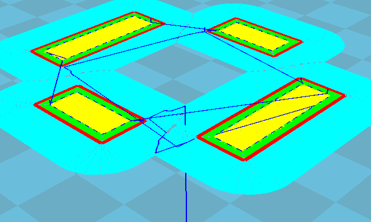
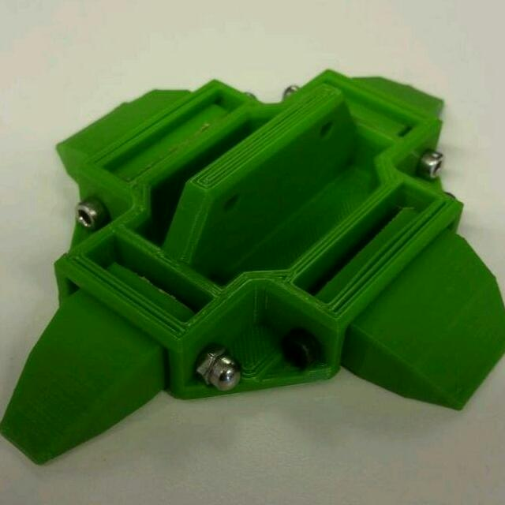
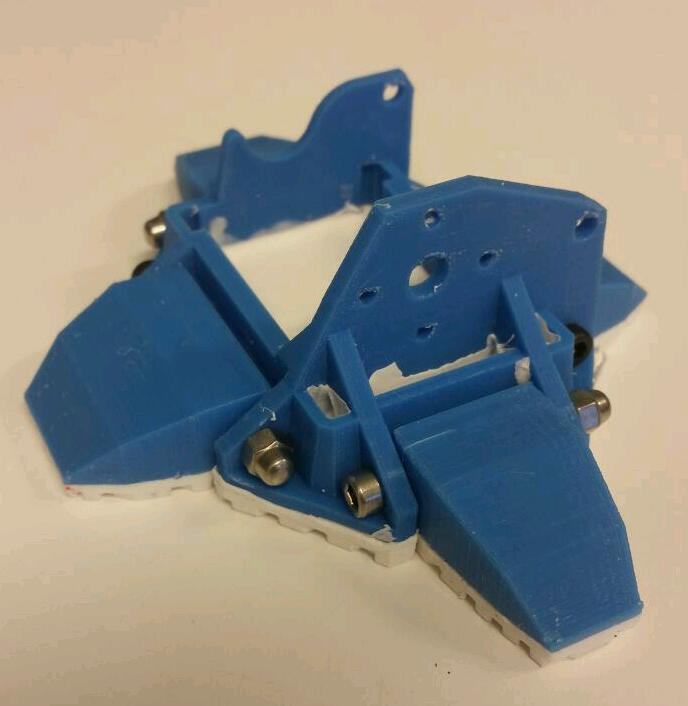
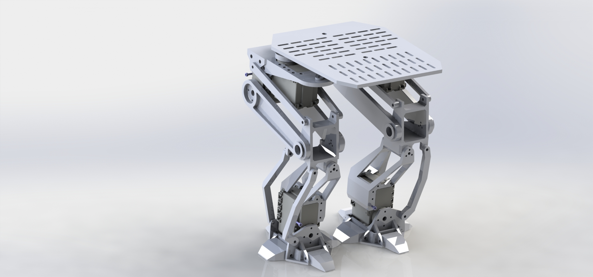
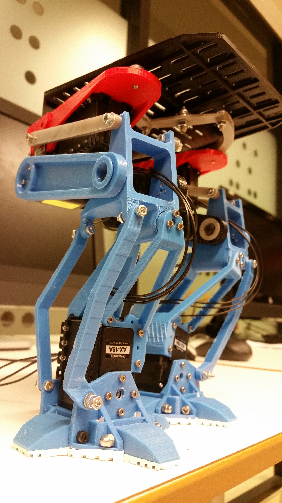

# Drunkbot
A project for the [INF4500 Rapid Prototyping course at UiO, spring 2017](http://folk.uio.no/matsh/inf4500/)

A bipedal walker I made for the INF4500 - Rapid prototyping course at the University of Oslo. The limitations for the project was max 6 servos per robot, no wheels, 400cm^3 material. 

This robot features silicon feet with grip-pattern which were injection molded directly onto the feet, movable 'toes' for dramatic effect, and no complete kinematic model for the robot. The servos being used are the Dynamixel AX-18A, driven over a serial USB connection. 
The robot parts are fully 3D printed where the white were printed in ABS for extra rigidity, and the others were printed in normal PLA. 

The whole robot is designed by me in solidworks. All files can be found in the zip archive at the github repo, but the archive is quite messy, and contains the SLDPRT files of earlier versions of the parts and such. I *think* the STL files under 'Project 1/solved/printables' should be the finished versions of each part. The idea was to move its center of mass directly over the foot in contact with the ground while lifting the other. This was accomplished by trial and error, as evident by the code.

**A video of the final result:**

## Images

## Conclusions
About the robot:
It has problems with stiffness, as the material bends under load. It was largely made with form over function, as the feet were ment to be reminiscent of the AT-ST from the Star Wars trilogy. This was a mistake, as the feet would be more stable with a different design. The linkage, and the placement of the servos suit the task well, as it results in a large freedom of movement. The controllers could be better programmed, with inspiration from [Underactuated Robotics](http://underactuated.csail.mit.edu/Spring2019/index.html#information). 

Personally, I learned a lot about the design process from this project, and it was probably the most fun challenge I've ever encountered in an academic setting. 
