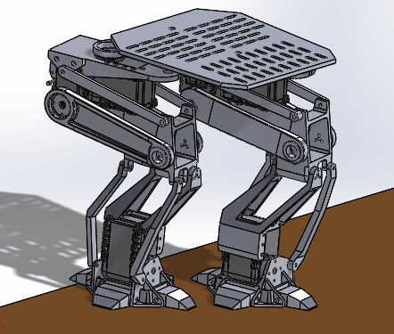

# Drunkbot
A project for the [INF4500 Rapid Prototyping course at UiO, spring 2017](http://folk.uio.no/matsh/inf4500/)

A bipedal walker I made for the INF4500 - Rapid prototyping course at the University of Oslo. The limitations for the project was max 6 servos per robot, no wheels, 400cm^3 material. 

This robot features silicon feet with grip-pattern which were injection molded directly onto the feet, movable 'toes' for dramatic effect, and no complete kinematic model for the robot. The servos being used are the Dynamixel AX-18A, driven over a serial USB connection. 
The robot parts are fully 3D printed where the white were printed in ABS for extra rigidity, and the others were printed in normal PLA. 

The whole robot is designed by me in solidworks, however I'm unable to obtain the sldprt files at this time, as they are connected to my user account at the university. The idea was to move its center of mass directly over the foot in contact with the ground while lifting the other. This was accomplished by trial and error, as evident by the code.

**A video of the final result:**

## Images

